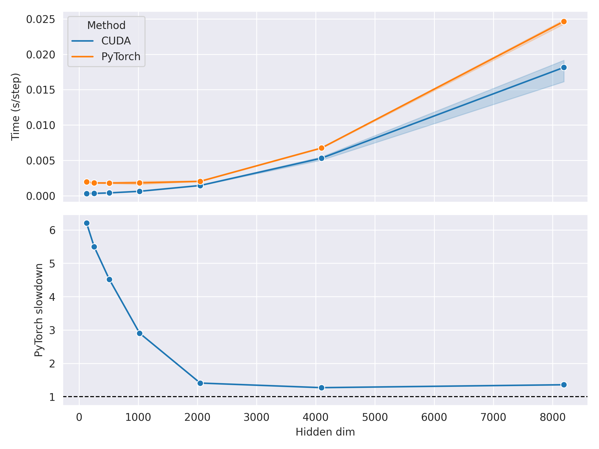
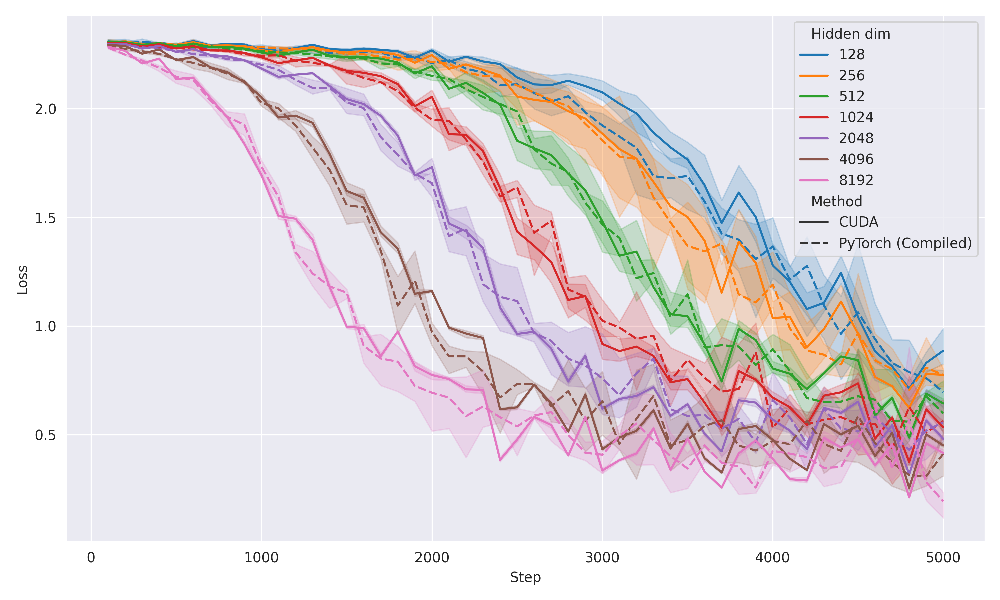

# Training MNIST from Scratch with CUDA

## But why?

I wanted to know how much overhead is added by Python-based ML frameworks like PyTorch, and how much faster we can possibly get by going lower-level (CUDA). It is also a good exercise for me to learn CUDA.

## So... how slow is PyTorch?

It's... pretty slow, at least for small networks. Even using PyTorch 2.0's `torch.compile` functionality (with `mode="max-autotune"` and `fullgraph=True`, which is supposed to remove all Python overhead), it can still be up to $6$ times slower than CUDA!

This overhead goes down as the network gets larger, though it never completely goes away. It asymptotically approaches $\approx 20\%$ times slower than CUDA.

    

There are a few reasons why PyTorch is (asymptotically) slower than CUDA:
1. The CUDA implementation pre-allocate all the tensors, so there is no memory allocation overhead. PyTorch (might) allocate and deallocate memory within each training step.
2. The CUDA implementation uses fp16 accumulation for matrix multiplication, which I found to be faster than fp32 accumulation. (I think) PyTorch uses fp32 accumulation.
3. I tuned the hyperparameters for the CUDA implementation specifically for my hardware. I'm not sure if `max-autotune` does the same for PyTorch.

> [!NOTE]
> I applied a few optimisations to both implementations.
> 1. I preloaded all data into memory in order to minimise the host-device data transfer overhead.
> 2. I allowed the PyTorch implementation to have a few warm-up steps before timing, to allow the JIT compiler to compile the graph.

## Matrix multiplication on GPU

The [CUTLASS docs](https://github.com/NVIDIA/cutlass/blob/main/media/docs/) have a detailed explanation of how matrix multiplication works. I'll try to explain it more intuitively here.

Matrix multiplication is often referred to as GEMM (General Matrix Multiplication) in the CUDA world. Efficient matrix multiplication is highly hardware-specific and so the design of the algorithm maps closely to the hardware architecture.

> [!NOTE]
> **Brief overview of CUDA architecture**
> | Level        | Memory hierarchy | Definition                                     |
> | ------------ | ---------------- | ---------------------------------------------- |
> | Device       | Global memory    | -                                              |
> | Thread block | Shared memory    | A collection of warps, executed on a single SM |
> | Warp         | -                | 32 threads, scheduled by the warp scheduler    |
> | Thread       | Registers        | Executed on a single CUDA core                 |

### Paralleling matrix multiplication

Suppose we want to multiply two matrices $A \in \mathbb{R}^{M \times K}$ and $B \in \mathbb{R}^{K \times N}$ to make $C \in \mathbb{R}^{M \times N} = AB$. In this case, we say that the problem size is $(M, N, K)$. To parallelise this operation, we will split $A$ and $B$ into smaller matrices, matrix multiply them individually and concatenate the results to form $C$.

Specifically, we can partition $M$ into chunks of size $M'$ and $N$ into chunks of size $N'$. Mathematically, this looks like:

$$
\begin{align}
    A &= \begin{bmatrix}
        A_{1} \\
        \vdots \\
        A_{M/M'} \\
    \end{bmatrix} \text{, where } A_{i} \in \mathbb{R}^{M' \times K} \\
    B &= \begin{bmatrix}
        B_{1} & \cdots & B_{N/N'} \\
    \end{bmatrix} \text{, where } B_{j} \in \mathbb{R}^{K \times N'} \\
    C_{i,j} &= A_i B_j \\
    C &= \begin{bmatrix}
        C_{1,1} & \cdots & C_{1,N/N'} \\
        \vdots & \ddots & \vdots \\
        C_{M/M',1}  & \cdots & C_{M/M',N/N'} \\
    \end{bmatrix}
\end{align}
$$

We can see that each sub-matrix $C_{i,j} = A_i B_j$ in $C$ are independent of each other, so we can easily parallelise the computation of each sub-matrix. 

In practice, $K$ might be too large to directly compute on. Instead, a typical implementation will split $K$ into chunks of size $K'$, iterate over each chunk, and accumulate (by summing) over the partial results. This is known as **serial-K reduction**. (As opposed to [**parallel-K reduction**](TODO)). Mathematically, this looks like:

$$
\begin{align}
    A_i &= \begin{bmatrix}
        A_{i,1} & \cdots & A_{i,K/K'}
    \end{bmatrix}, \text{ where } A_i^{(k)} \in \mathbb{R}^{M' \times K'} \\
    B_j &= \begin{bmatrix}
        B_{j,1} \\
        \vdots \\
        B_{j,K/K'} \\
    \end{bmatrix}, \text{ where } B_j^{(k)} \in \mathbb{R}^{K' \times N'} \\
    C_{ij} &= \sum_{k=1}^{K/K'} A_{i,k} B_{j,k}
\end{align}
$$

### Data redundancy

The key observation is that many of the sub-inputs $A_i$ and $B_j$ are reused across different sub-matrix multiplications. For example, $A_1$ is required for $C_{1,1}$, $C_{1,2}$, ..., $C_{1,N/N'}$ and $B_1$ is required for $C_{1,1}$, $C_{2,1}$, ..., $C_{M/M',1}$. We can get the highest throughput if we can minimise redundant data movement and reuse the loaded sub-inputs as much as possible.

In CUDA, there are three types of user-accessible memory:

| Memory type   | Capacity             | Bandwidth & latency  | Shared by     |
| ------------- | -------------------- | -------------------- | ------------- |
| Global memory | :star: :star: :star: | :star:               | Thread blocks |
| Shared memory | :star: :star:        | :star: :star:        | Warps         |
| Registers     | :star:               | :star: :star: :star: | Tensor cores  |

Each memory level acts as a (user-managed) cache for the level above it. To minimise the time spent on data movement, we want to load the data into the low level caches and reuse them to compute as many sub-matrix multiplications as possible.

#### Thread block level

On the thread block level, the problem is partitioned into sub-problems of size $(M', N', K')$. Thus, each thread block is responsible for computing the fragment $C_{i,j} \in \mathbb{R}^{M' \times N'}$:

$$
C_{i,j} = \sum_{k=1}^{K/K'} A_{i,k} B_{j,k}
$$

where $A_{i,k} \in \mathbb{R}^{M' \times K'}$ and $B_{j,k} \in \mathbb{R}^{K' \times N'}$.

Redundant data movement is minimised by loading the sub-inputs $A_{i,k}$ and $B_{j,k}$ into **shared memory**. Any accesses to $A_{i,k}$ and $B_{j,k}$ *within* a thread block will then be served by the shared memory (instead of the global memory).

In my implementation, a partition size of $(M', N', K') = (128, 256, 32)$ is used.

#### Warp level

On the warp level, the sub-problem is further partitioned into sub-sub-problems of size $(M'', N'', K'')$. Thus, each warp is responsible for computing the fragment $C_{i,j}^{(m,n)} \in \mathbb{R}^{M'' \times N''}$:

$$
C_{i,j}^{(m,n)} = \sum_{k=1}^{K/K'} \sum_{l=1}^{K'/K''} A_{i,k}^{(m,l)} B_{j,k}^{(l,n)}
$$

where $A_{i,k}^{(m,l)} \in \mathbb{R}^{M'' \times K''}$ and $B_{j,k}^{(l,n)} \in \mathbb{R}^{K'' \times N''}$.

Redundant data movement is minimised by loading the sub-inputs $A_{i,k}^{(m,l)}$ and $B_{j,k}^{(l,n)}$ into **registers**. Any accesses to $A_{i,k}^{(m,l)}$ and $B_{j,k}^{(l,n)}$ *within* a warp will then be served by the fast registers.

> [!NOTE]
> It is worth noting that registers are **thread-level only**. This means that inputs in a register cannot be accessed by other threads in a warp. The exact way of how $A_{i,k}^{(m,l)}$ and $B_{j,k}^{(l,n)}$ are partitioned into the registers of each thread depends on the specific instruction used. The NVIDIA docs on [Warp Level Matrix Multiply-Accumulate Instructions](https://docs.nvidia.com/cuda/parallel-thread-execution/index.html#warp-level-matrix-instructions) gives a detailed description for each instruction.

In my implementation, a warp-level partition size of $(M'', N'', K'') = (64, 64, 32)$ is used.

#### Tensor core level

To actually perform the matrix multiplication, we use the **Tensor Cores** on the GPU. My GPU (RTX 2060) has the second generation Tensor Cores, which are specialised to solve problems of size $(M''', N''', K''') = (16, 8, 8)$. Thus, we even further partition $C_{i,j}^{(m,n)}$ into sub-sub-sub-problems of size $(16, 8, 8)$:

$$
C_{i,j}^{(m,n)|(a,b)} = \sum_{k=1}^{K/K'} \sum_{l=1}^{K'/K''} \sum_{p=1}^{K''/8} A_{i,k}^{(m,l)|(a,p)} B_{j,k}^{(l,n)|(p,b)}
$$

where $A_{i,k}^{(m,l)|(a,p)} \in \mathbb{R}^{16 \times 8}$ and $B_{j,k}^{(l,n)|(p,b)} \in \mathbb{R}^{8 \times 8}$. Here, all the inputs are already in the registers and thus the data movement overhead is minimal. 

> [!NOTE]
> Tensor Core operations are **warp-level instructions**, meaning that all the threads in a warp need to execute the Tensor Core instruction at the same time, collaboratively preparing the data to be consumed by **one** Tensor Core.

### Even more optimisations

#### Parallel-K reduction

In cases where $M$ and $N$ are small, we might only have a few thread blocks. For example in my implementation, I chose the thread block partition size to be $(M', N') = (128, 256)$. If the original problem size has $M \leq 128$ and $N \leq 256$, we will only have one thread block. This is an issue because each thread block can only execute in one **Streaming Multiprocessor** (SM) but most GPUs have multiple SMs. For example, my RTX 2060 has 30 SMs. This means that we are only using $\frac{1}{30}$ of the GPU's compute power!

In cases where $K$ is large (even though $M$ and $N$ are small), we can utilise more parallelism by doing **parallel-K reduction**. Recall that in *serial*-K reduction, each thread block iterates over the following sum:

$$
C_{i,j} = \sum_{k=1}^{K/K'} A_{i,k} B_{j,k}
$$

and accumulates the intermediate results into $C_{i,j}$. In parallel-K reduction, we instead assign each thread block to only compute *one element of the sum* (i.e. $A_{i,k} B_{j,k}$). This allows us to increase the number of thread blocks by a factor of $K/K'$, thus utilising more SMs. 

The caveat is that now, we need to *allocate more memory* to store the results from each thread block, and *invoke a second kernel* to perform a final reduction over the partial results to get $C_{i,j}$.

#### Software pipelining

Normally, CUDA hides the latency of memory accesses by scheduling other warps to execute while a warp is waiting for data. This requires us to have enough warps to mask the latency. 

However, the number of warps is typically relatively small when doing GEMM. This is because the number of warps is limited by $\frac{\text{Number of registers per thread block}}{\text{Number of registers per warp}}$, and for GEMM we use a lot of registers per warp to hold as much data as possible. As a result, we might not have enough warps to mask the latency.

> The CUTLASS docs mention that *"The accumulator elements typically occupy at least half a thread's total register budget"*. 

To mitigate this effect, we can use **software pipelining**. In essence, we (manually) preload the inputs for the next iteration of the loop asynchronously using special instructions. While the inputs are being loaded, we can continue to compute on the current iteration. It is summarised by the following diagram:

    

## Loss curve sanity check

Comparing the loss curves of the PyTorch and CUDA implementations, we can see that they are pretty much identical.

    

