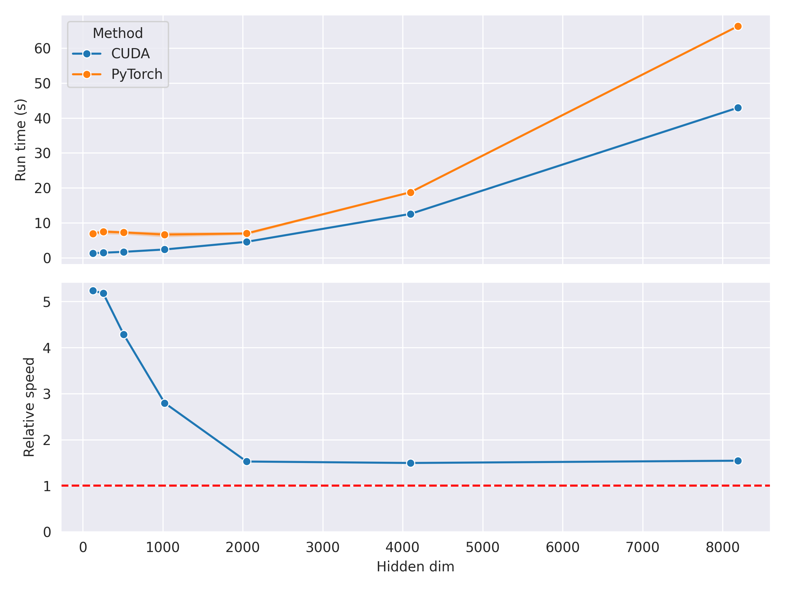

# Training MNIST from Scratch with CUDA

> This project is developed on a RTX 3060 (Ampere). Modifications are required to run on other architectures.

## But why?

I wanted to know how much overhead is added by Python-based ML frameworks like PyTorch, and how much faster we can possibly get by going lower-level (CUDA). It is also a good exercise for me to learn CUDA.

Coming from a Python/PyTorch/JAX-heavy background, this is my first time doing a large-ish CUDA project. Compared to many C++/CUDA repositories out there, I consider the code to be pretty clean and "pythonic", which hopefully makes it also approachable for other CUDA beginners.

I also wrote a blog post on **How Matrix Multiplication Works on the GPU**, you can read it on [here on HackMD](https://hackmd.io/@andylo/matrix-multiplication-on-gpu) or [here on Medium](https://towardsdatascience.com/matrix-multiplication-on-the-gpu-e920e50207a8?source=friends_link&sk=020a915e1fce7d910aacda22bce89129).

## So... how slow is PyTorch?

It's... pretty slow, at least for small networks. For small models (hidden dim $\leq 256$) it can still be up to $5$ times slower than CUDA!

This overhead goes down as the network gets larger, though it never completely goes away. It asymptotically approaches $\approx 50$% slower than CUDA.

    

Even for larger networks, this CUDA implementation is still $\approx 50$% faster than PyTorch! The main reasons are:
1. This implementation usees fp16 accumulation for matrix multiplication while PyTorch uses fp32. NVIDIA reports double(!) the amount of theoretical throughput using fp16. PyTorch defaults to fp32 for stability reasons, but I haven't encountered those issues in my runs.
2. This implementation fuses the SGD update step with the backward pass, saving a lot of bandwidth in loading and storing the parameters and gradients.

> [!NOTE]
> I applied a few optimisations to both implementations.
> 1. I preloaded all data into memory in order to minimise the host-device data transfer overhead.
> 2. I allowed the PyTorch implementation to have a few warm-up steps before timing.

My implementation is also not perfect! For example, I didn't use vectorized loads for my element-wise kernels (e.g., `relu`). I expect this to give a pretty substantial speedup too.

## Loss curve sanity check

Comparing the loss curves of the PyTorch and CUDA implementations, we can see that they are pretty much identical.

    

